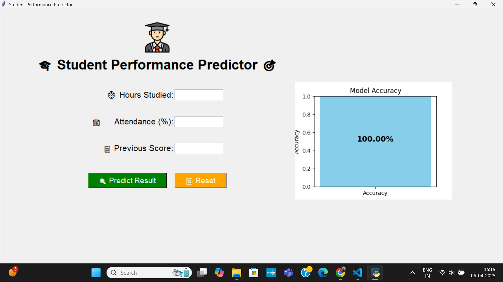
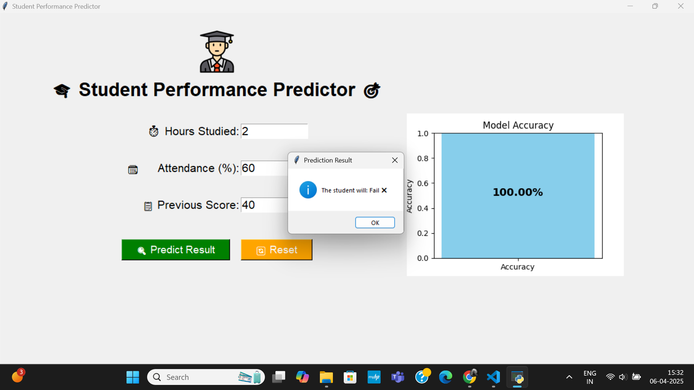
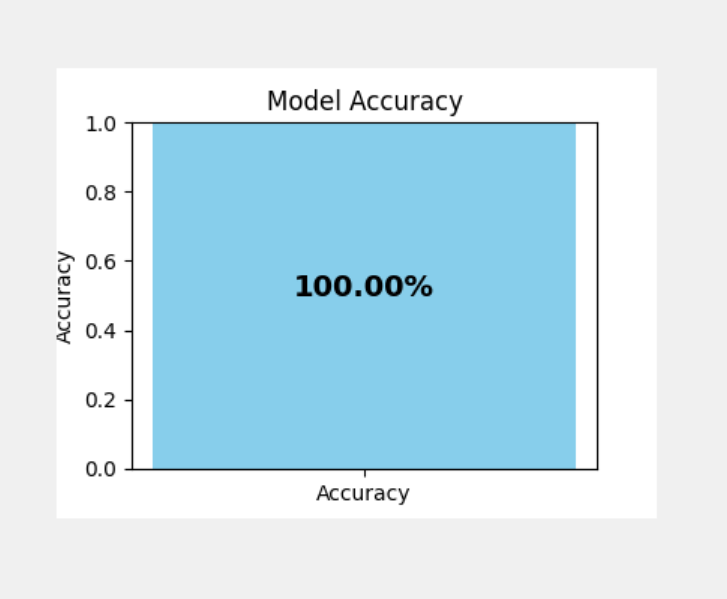

Student Performance Predictor 🎓📊

An interactive desktop application using Python Tkinter and Machine Learning to predict student performance based on study habits, attendance, and exam preparation. This project features a GUI with fun emojis 😄📘📈, prediction confidence levels, and an accuracy graph.

📌 Features

🎯 Predicts whether a student will Pass or Fail.

📈 Displays model accuracy graph.

🔮 Shows prediction confidence level.

👨‍🎓 Big student icon and project title at the top.

🎨 Fullscreen colorful GUI with emojis, big fonts, and clear inputs.

🔄 Reset/Clear button to start fresh.

🧠 Machine Learning

Model: Logistic Regression (can be replaced with other classifiers)

Training: Done using preprocessed CSV dataset.

Libraries: sklearn, pandas, numpy, matplotlib

🖥️ GUI Built with Tkinter

Responsive fullscreen window.

User-friendly interface.

Big buttons, inputs, and icons for better usability.

📁 Project Structure

StudentPerformancePredictor/
├── Screenshots
    ├── graph_accuracy.png
    ├── prediction_result.png
    ├── test_case-1.png
    ├── test_case-2.png
    ├── ui.png
├── demo_video.mp4
├── main.py
├── README.md
├── requirements.txt
└── student.png

🚀 How to Run

Clone the repo:

git clone https://github.com/yourusername/StudentPerformancePredictor.git
cd StudentPerformancePredictor

Install dependencies:

pip install -r requirements.txt

Run the app:

python main.py

📸 Screenshots

🧑‍💻 Main UI

📊 Prediction Result

🧪 Test Case - 1

🧪 Test Case - 2

📉 Accuracy Graph

🎥 Demo Video

You can view the complete working demo of the project below:
[🔗 Click here to watch the demo video](demo_video.mp4)

📦 Requirements

-> numpy
-> pandas
-> matplotlib
-> scikit-learn
-> tk

💼 Impress Interviewers ✅

📌 Add this GitHub repo to your resume.

🧠 Shows knowledge in ML, Python, and GUI development.

🌟 Bonus points for clean code, README, and interactive video demo.

🤝 Contributions

Pull requests are welcome. For major changes, please open an issue first.
 
📜 License

MIT License

Developed by Akula Venkat Naidu 🧑‍💻